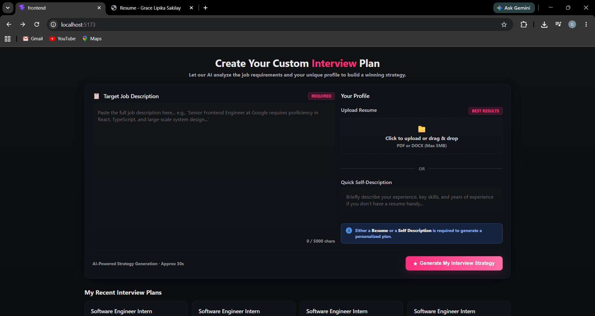
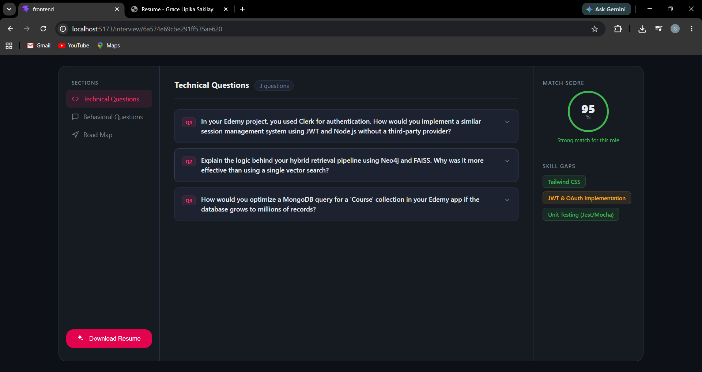
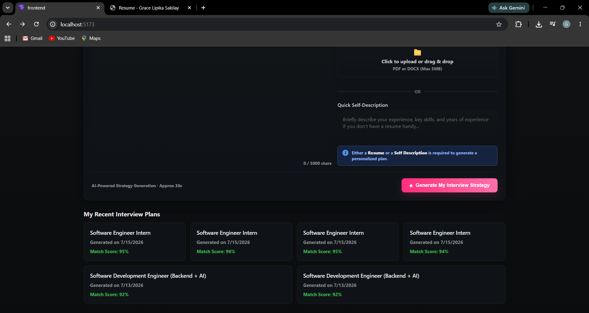

# AI Interview Prep

A full-stack Gen AI application that generates a personalized interview strategy — technical questions, behavioral questions, skill-gap analysis, and a day-by-day preparation roadmap — from a candidate's resume and a target job description. Built with the Gemini API, Node.js/Express, MongoDB, and React.

## Screenshots

**Create a custom interview plan from a resume, self-description, and job description:**



**AI-generated interview report — technical questions, match score, and skill gaps:**



**Track and revisit previously generated interview plans:**



## Features

- **AI-powered report generation** — Upload a resume (PDF) or write a quick self-description, paste a job description, and get a structured interview report generated by Gemini
- **Technical & behavioral questions** — Each question includes the interviewer's intention and a model answer, so you know not just *what* might be asked but *why*
- **Match score** — A 0–100 score estimating how well your profile fits the target role
- **Skill gap analysis** — Flags missing skills with severity ratings (low / medium / high)
- **Day-by-day preparation roadmap** — A structured study plan tailored to the specific role
- **Resume PDF generation** — Generates and downloads a tailored, ATS-friendly resume as a PDF using Puppeteer
- **Authentication** — JWT-based auth with HttpOnly cookies and a token blacklist for secure logout
- **Report history** — All previously generated reports are saved and browsable from the home page

## Tech Stack

**Frontend**
- React (Vite)
- React Router
- Axios
- SCSS

**Backend**
- Node.js / Express
- MongoDB + Mongoose
- JWT authentication (`jsonwebtoken`, `cookie-parser`)
- `multer` for file uploads
- `pdf-parse` for resume text extraction
- `puppeteer` for PDF generation

**AI**
- Google Gemini API (`@google/genai`) with structured JSON output via schema-constrained responses

## Project Structure

```
GenAi_FS_Project/
├── Backend/
│   ├── src/
│   │   ├── controllers/       # Route handlers (auth, interview)
│   │   ├── middlewares/       # Auth guard, multer config
│   │   ├── models/            # Mongoose schemas (User, InterviewReport, BlacklistToken)
│   │   ├── routes/            # Express routers
│   │   ├── services/          # Gemini API integration (ai.service.js)
│   │   ├── config/            # Database connection
│   │   └── app.js
│   └── server.js
└── Frontend/
    └── src/
        ├── features/
        │   ├── auth/           # Login, Register, auth context/hooks, Protected route
        │   └── interview/      # Home, Interview report page, interview context/hooks
        ├── app.routes.jsx
        └── App.jsx
```

## Getting Started

### Prerequisites
- Node.js (v18+)
- A MongoDB connection string (local or [MongoDB Atlas](https://www.mongodb.com/cloud/atlas))
- A [Google Gemini API key](https://ai.google.dev/)

### Backend Setup

```bash
cd Backend
npm install
```

Create a `.env` file in `Backend/`:

```env
PORT=3000
MONGO_URI=your_mongodb_connection_string
JWT_SECRET=your_jwt_secret
GOOGLE_GENAI_API_KEY=your_gemini_api_key
```

```bash
npm run dev
```

### Frontend Setup

```bash
cd Frontend
npm install
npm run dev
```

The frontend runs on `http://localhost:5173` and expects the backend at `http://localhost:3000`.

## API Overview

| Method | Endpoint                  | Description                              |
|--------|----------------------------|-------------------------------------------|
| POST   | `/api/auth/register`      | Register a new user                       |
| POST   | `/api/auth/login`         | Log in and receive an auth cookie         |
| GET    | `/api/auth/logout`        | Log out and blacklist the current token   |
| GET    | `/api/auth/get-me`        | Get the currently authenticated user      |
| POST   | `/api/interview`          | Generate a new interview report           |
| GET    | `/api/interview/:id`      | Fetch a specific interview report by ID   |

## Acknowledgements

Built while following [Sheryians Coding School's Gen AI + Full Stack tutorial](https://youtu.be/zG3hNL08Dro), with debugging, schema fixes, and UI adjustments along the way.

## License

MIT
